# Springboard Internship Program  
## Batch B13 – AirFly Insights  
### Data Visualization and Analysis of Airline Operations  

---

#  Program Overview

This repository is created for the Springboard Internship Program (8 Weeks).

This is a project-driven internship designed to provide hands-on experience in real-world data analysis and visualization.  

⚠ This is NOT a lecture-based training program.  
Sessions are focused on implementation, milestone execution, evaluation, and structured project development.

---

#  Project Title

## AirFly Insights: Data Visualization and Analysis of Airline Operations

The objective of this project is to analyze large-scale airline flight datasets to uncover:

- Operational trends  
- Delay patterns  
- Cancellation reasons  
- Seasonal impacts  
- Route and airport-level performance insights  

------------------------------------------------------------------------

#  Project Workflow

Milestone 1 → Data Understanding\
Milestone 2 → Exploratory Data Analysis\
Milestone 3 → Operational Insights

------------------------------------------------------------------------

#  Repository Structure

Robinson/ │ ├── Milestone - 01.ipynb ├── Milestone - 02.ipynb ├──
Milestone - 03.ipynb 

------------------------------------------------------------------------

#  Dataset

The project uses a flight operations dataset containing:

  Column      Description
  ----------- -------------------------------
  FL_DATE     Flight date
  AIRLINE     Airline name
  ORIGIN      Origin airport
  DEST        Destination airport
  DEP_DELAY   Departure delay
  ARR_DELAY   Arrival delay
  DISTANCE    Flight distance
  CANCELLED   Flight cancellation indicator
  DIVERTED    Diversion indicator

Approximate dataset size: \~3 million flight records

------------------------------------------------------------------------

#  Technologies Used

-   Python
-   Jupyter Notebook
-   Pandas
-   NumPy
-   Matplotlib
-   Seaborn
-   Missingno
-   Git

------------------------------------------------------------------------

#  Milestone 01 --- Data Understanding & Cleaning

Key Steps: - Dataset loading - Data inspection (shape, columns, info) -
Data type corrections - Date conversion - Binary column fixes - Missing
value visualization

Example visualization:

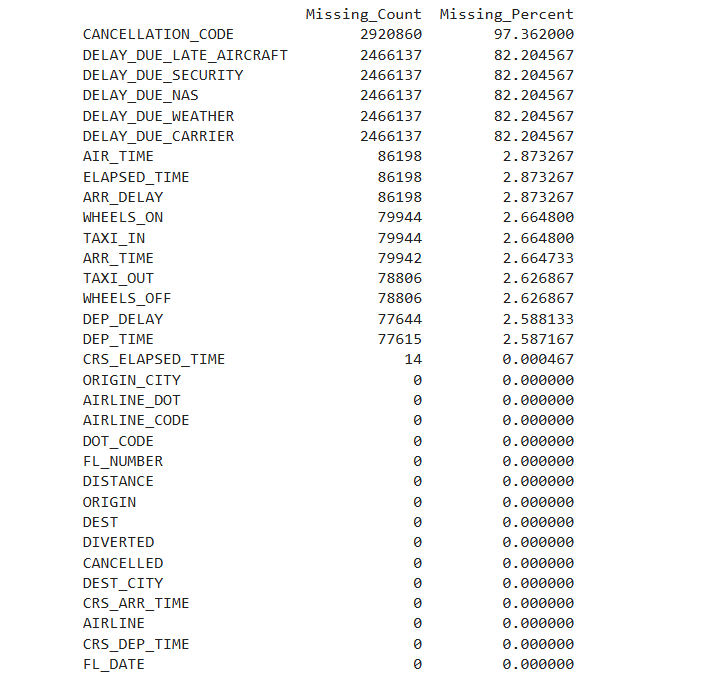

------------------------------------------------------------------------

# Milestone 02 --- Exploratory Data Analysis

Key Analyses:

### Airline Market Share

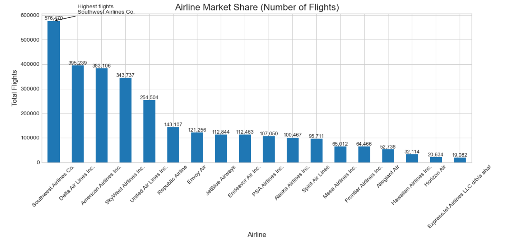

### Busiest Origin Airports

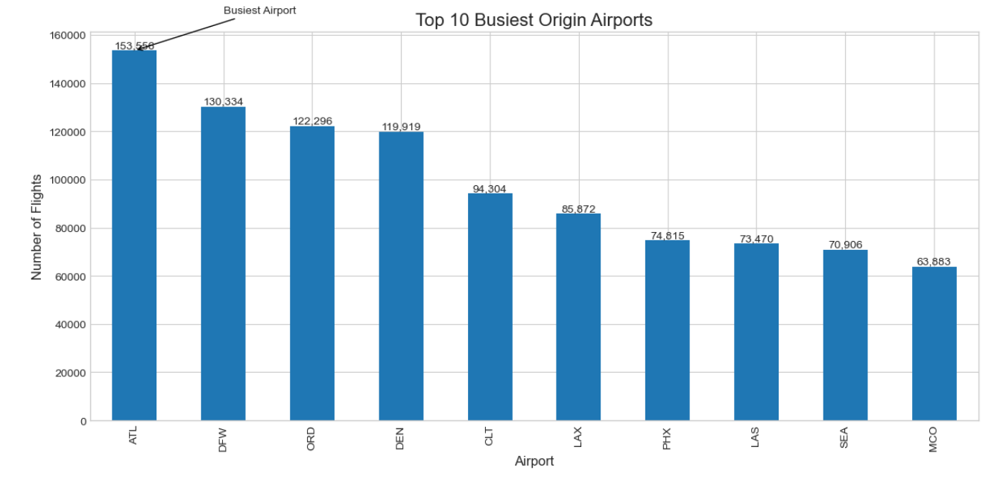

### Monthly Flight Trends

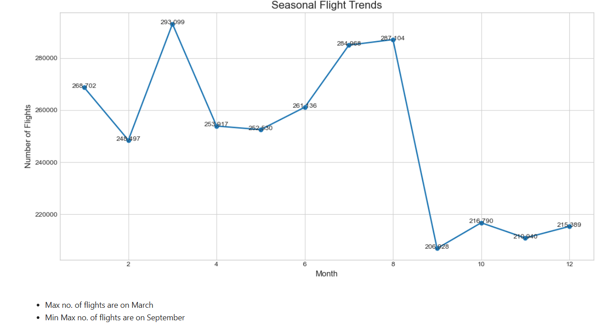

### Weekly Flight Distribution

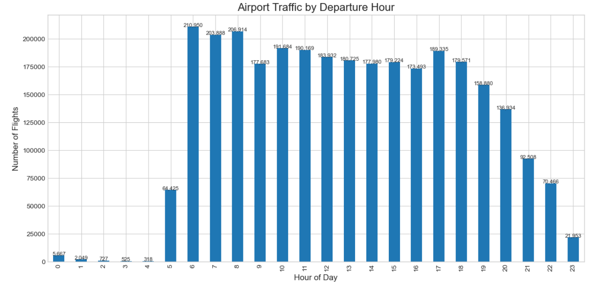

### Departure Hour Traffic

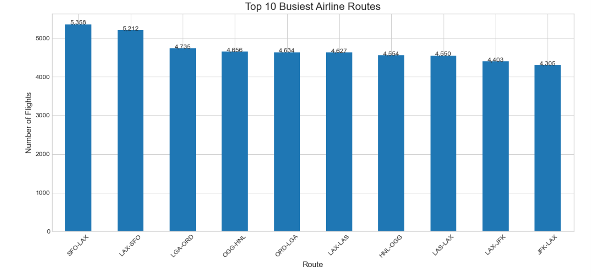

------------------------------------------------------------------------

# 🚀 Milestone 03 --- Operational Insights

### Top Flight Routes

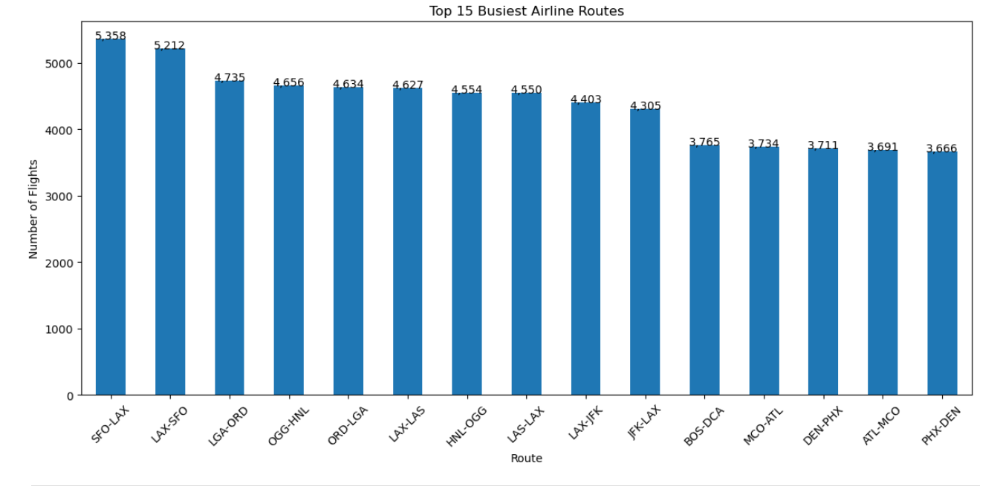

### Distance Group Analysis

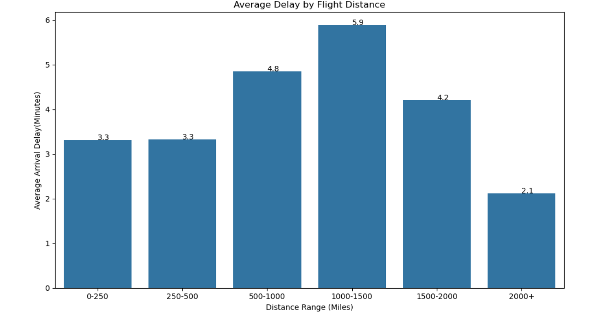

### Airport Traffic

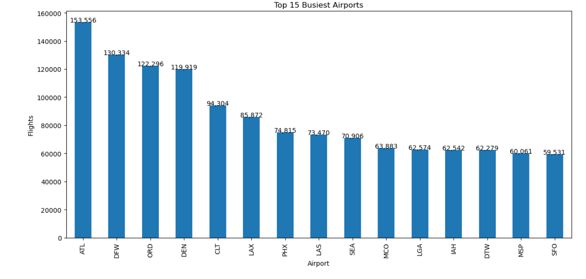

### Airport Delay Analysis

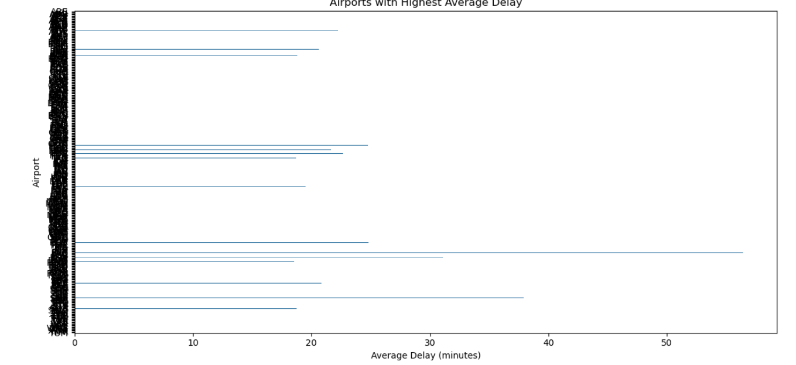

### Cancellation Rate

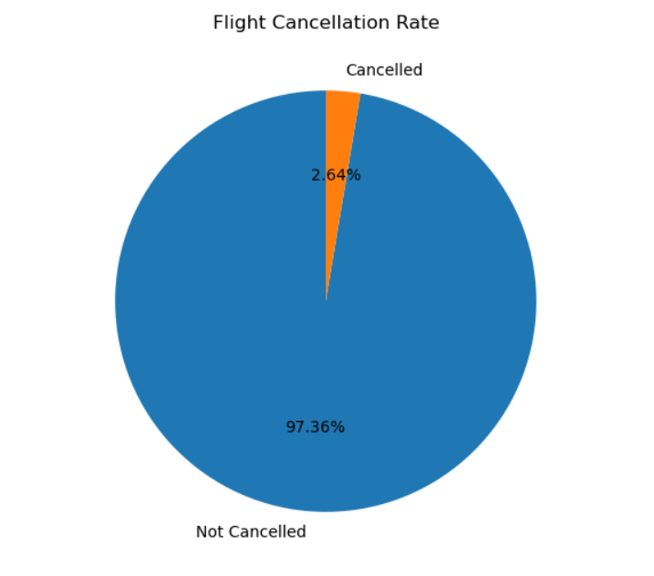

### Cancellation Reasons

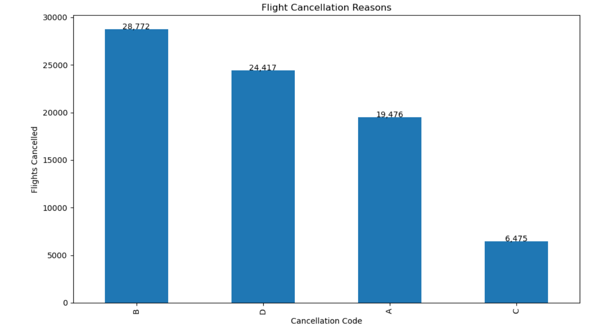
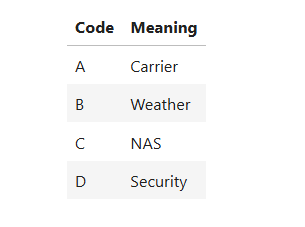

------------------------------------------------------------------------

#  Key Insights

-   Flight traffic varies significantly by season and day of week
-   Certain airports handle significantly higher traffic volume
-   Delay patterns differ across airports
-   Weather and carrier issues are major causes of cancellations
-   Certain routes dominate airline traffic networks

------------------------------------------------------------------------

#  How to Run

Clone the repository:

git clone
https://github.com/springboardmentor1234r/B13-AirFly-Insights-Internship.git

Navigate to the project folder:

cd B13-AirFly-Insights-Internship

Open the notebooks:

jupyter notebook

------------------------------------------------------------------------

#  Skills Demonstrated

-   Exploratory Data Analysis
-   Data Cleaning
-   Feature Engineering
-   Aviation Operational Analytics
-   Data Visualization
-   Git Version Control

------------------------------------------------------------------------

#  Author

Robinson\
Data Analytics Intern\
AirFly Insights Internship

------------------------------------------------------------------------

#  Acknowledgement

Thanks to the AirFly Insights Internship mentors for their guidance and
support.
